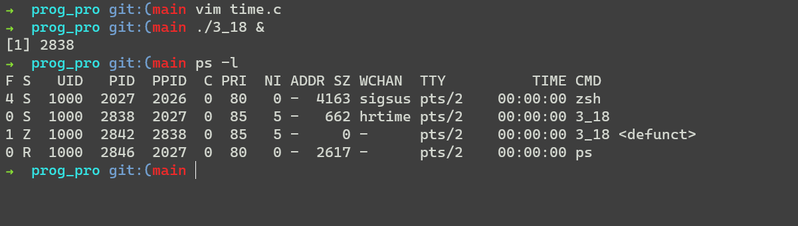
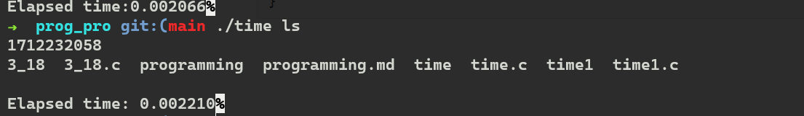
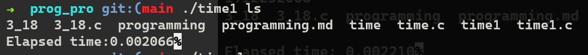
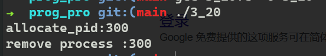
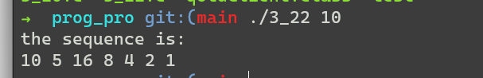
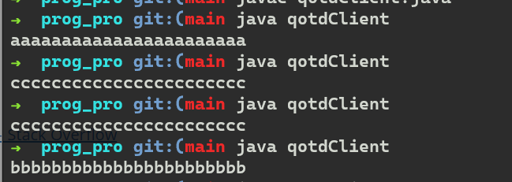
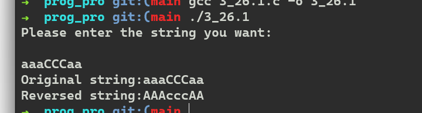
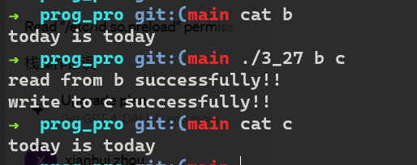

# Programming languages

## 3_18

代码：

```c
#include<stdio.h>
#include<unistd.h>
#include<stdlib.h>
#include<sys/types.h>
#include<sys/wait.h>

int main(){
	pid_t pid;
	pid = fork();
	if(pid == 0){
		//sleep(100);// ms
		exit(0);
	}else if(pid > 0){
		// nothing
		sleep(10000);
		exit(0);
	}else{
		puts("failed to fork");
	}
}
```

结果



## 3_19

### solution 1

利用共享内存进行传送。先在子进程创建一个共享区段，并写入数据，然后父进程通过该区段进行读取数据。

```c
#include<stdio.h>
#include<sys/types.h>
#include<wait.h>
#include <sys/time.h>
#include<string.h>
#include<stdlib.h>
#include<fcntl.h>
#include<sys/shm.h>
#include<sys/mman.h>
#include<sys/stat.h>
#include <unistd.h>

int main(int argc,char* argv[]){
	pid_t pid;
	pid = fork();
	if(pid < 0){
		puts("failed to fork");
	}else if( pid == 0 ){ /* child process */
		const int SIZE = 4096;
		const char *name = "OS";
		int shm_fd;
		long int *ptr;
		struct timeval tv;
		int mark = gettimeofday(&tv,NULL);
		if(mark){
			puts("failed to gettimeofday");
		}
		// write to shared-memory
		// open shared memeory object
		shm_fd = shm_open(name,O_CREAT | O_RDWR,0666); /* without execution right */
		/* configure the size of the shared memory */
		ftruncate(shm_fd,SIZE);
		// memory map
		ptr = (long int*)mmap(0,SIZE,PROT_READ | PROT_WRITE,MAP_SHARED,shm_fd,0);
		if(ptr == MAP_FAILED) {
			perror("mmap");
			exit(1);
    	}
		/* write to sh-me */
		//printf("sec:%ld\n",tv.tv_sec);
		*ptr = tv.tv_sec;
		//printf("hello\n");
		*(ptr + 1) = tv.tv_usec;
		printf("%ld\n",*ptr);
		//sprintf(ptr,"%ld",tv.tv_usec);
		if(execlp(argv[1],"",NULL)){
			puts("failed to execlp");
		}
		exit(0);
	}else { /* parent process */
		wait(NULL);
		/* get time of now */
		struct timeval tv;
		int mark = gettimeofday(&tv,NULL);
		if(mark){
			puts("failed to gettimeofday");
		}

		/* get the time from child */
		const int SIZE = 4096;
		const char *name = "OS";
		int shm_fd;
		long int*ptr;
		
		shm_fd = shm_open(name,O_RDONLY,0666);
		//printf("%d\n",shm_fd);
		ptr = (long int *)mmap(0,SIZE,PROT_READ,MAP_SHARED,shm_fd,0);
		if (ptr == MAP_FAILED) {
			perror("mmap");
			exit(1);
		}
		long int old_sec,old_usec;
		//printf("aaaa\n");
		old_sec = *ptr;
		//printf("aaaa\n");
		old_usec = *(ptr+1);
		printf("\nElapsed time: %lf",(double)tv.tv_sec-old_sec+(double)(tv.tv_usec-old_usec)/1000000);
shm_unlink(name); }
	return 0;
}
```

结果



### solution 2

通过管道，先在创建子进程前创建管道（产生相应的句柄），这样能使管道在子父进程中都存在。利用句柄在子进程写入时间信息，在子进程结束后，在父进程中读入当前时间，并通过子进程传送的时间，计算得到子进程运行时间。

```c
#include<stdio.h>
#include<sys/types.h>
#include<wait.h>
#include<sys/time.h>
#include<unistd.h>
#include<stdlib.h>

#define BUFFER_SIZE 25
#define READ_ENd 0
#define WRITER_END 1

int main(int argc,char* argv[]){
	struct time;
	//long int sec,usec;
	int fd[2];
	pid_t pid;
	struct timeval tv;
	if(pipe(fd) == -1){
		fprintf(stderr,"Pipe failed");
	}

	pid = fork();
	if(pid < 0){
		fprintf(stderr,"fork failed");
	}else if(pid == 0){
		int mark = gettimeofday(&tv,NULL);
		if(mark ){
			fprintf(stderr,"gettimeofday failed");
		}
		/* close read end of the pipe */
		close(fd[READ_ENd]);
		/* write to the pipe */
		write(fd[WRITER_END],&tv,sizeof(tv));
		/* close the write end of the pipe */
		close(fd[WRITER_END]);
		if(execlp(argv[1],"",NULL))
			fprintf(stdout,"execlp failed");
		exit(0);

	}else{
		struct timeval tv1;
		wait(NULL);
		int mark = gettimeofday(&tv1,NULL)	;
		if(mark )
			fprintf(stderr,"gettimeofday failed");
		/* close the write end of the piep */
		close(fd[WRITER_END]);

		read(fd[READ_ENd],&tv,sizeof(tv));
		
		close(fd[READ_ENd]);

		fprintf(stdout,"Elapsed time:%f",(double)tv1.tv_sec-tv.tv_sec+(double)(tv1.tv_usec-tv.tv_usec)/1000000);
	}

	return 0;
}
```

结果：



## 3_20

利用数组，并将每个位都利用起来。利用位的index和pid的关系，联系起来。

```c
#include<stdio.h>
#include<sys/types.h>
#include<wait.h>
#include<time.h>
#include<stdlib.h>
#include<string.h>

#define MIN_PID 300
#define MAX_PID 5000

#define char_size 8
char *bitmap; // 杩涚▼鍙锋槸鍚︾┖闂?
int allocate_map(){
	bitmap = (char*)malloc((MAX_PID-MIN_PID)/char_size*char_size);
	if(bitmap){
		memset(bitmap,0,(MAX_PID-MIN_PID)/char_size*char_size);
		return 1;
	}
	return 0;
}

/*
int getArandom(){
	srand((unsigned)time(NULL));
	int ran = rand();
	return ran >= 300 ? ran%5000 : ran+300;
}
*/

int allocate_pid(){
	int i;
	int mark = 0;
	for(i=0; i <= MAX_PID-MIN_PID;i++){
		int index = i/8;// 瀹氫綅瀛楄妭
		int offset = i%8; // 瀹氫綅鍋忕Щ
		int dest = 1 << offset;
		if( !(bitmap[index] & dest)){
			bitmap[index] |= dest;
			mark = 1;
			break;
		}
	}
	if(mark == 0) return 1;
	else return i + MIN_PID;
}

void release_pid(int pid){
	pid -= 300;
	int index = pid/8;
	int offset = pid%8;
	char dest = 1<< offset;
	bitmap[index] &= (~dest);
}


int main(){
	int mark = allocate_map();
	if(!mark){
		puts("allocate_map failed");
	}
	int pid = allocate_pid();
	if(pid == 1){
		puts("no extra process space");
	}else{
		printf("allocate_pid:%d\n",pid);
	}
	/*
	printf("allocate_pid:%d\n",pid);
	pid = allocate_pid();
	printf("allocate_pid:%d\n",pid);
	*/
	
	release_pid(pid);
	printf("remove process :%d\n",pid);

	free(bitmap);
	return 0;
}

```

结果：



## 3_21

**perrror 和 fprintf(stderr,...)的区别**

fprintf 自定义输出错误。

perror 根据本地变量errno的值来输出错误，注意需要再调用完syscall后立即调用，因为其他调用可能导致errno被修改。

```c
#include<stdio.h>
#include<sys/types.h>
#include<wait.h>
#include<time.h>
#include <unistd.h>
#include<sys/types.h>
#include<fcntl.h>

int main(){

	int a;
	/* no such file or directory */
	int fd = open("a",O_RDONLY);
	/* bad address */
	int fd2 = open(NULL, O_WRONLY|O_EXCL|O_CREAT ,0644);
	perror("perror");


	return 0;
}
```

结果输出：bad address

**代码**很简单，不多说

```c
#include<stdio.h>
#include<sys/types.h>
#include<wait.h>
#include<time.h>
#include<stdlib.h>
#include <unistd.h>
#include<sys/types.h>

int main(int argc, char* argv[]){
	int num = atoi(argv[1]);
	while(num <= 0){
		puts("\nfailed to run ,please enter a positive number:\n");
		scanf("%d",&num);
	}
	
	pid_t pid = fork();
	if(pid < 0){
		fprintf(stderr,"Fork failed");
		return 1;
	}
	else if( pid > 0 )
	{/* parent process */
		wait(NULL);
	}
	else
	{
		while(num != 1)
		{
			printf("%d ",num);
			if(num%2){
				num = 3*num + 1;
			}else{
				num = num/2;
			}
		}
		printf("1\n");
	}
	return 0;
}
```

**结果**


## 3_22

在创建子进程前将共享内存创建好，然后子进程写入，父进程就可以读取了。

```c
#include<stdio.h>
#include<sys/types.h>
#include<wait.h>
#include<time.h>
#include<stdlib.h>
#include<unistd.h>
#include<fcntl.h>
#include<string.h>
#include<sys/mman.h>
#include<sys/shm.h>
#include<sys/stat.h>

int main(int argc ,char* argv[]){
	if(argv[1] == NULL){
		puts("Please execute 3_22 like this :\n ./3_22 num");
		return 1;
	}
	int num = atoi(argv[1]);
	while(num <= 0){
		puts("Please enter a positive number");
		scanf("%d",&num);
	}
	const int SIZE = 4096;
	const char *name = "OS";
	int shm_fd;
	int* ptr;
	
	/* open shared memory object */
	shm_fd = shm_open(name,O_CREAT | O_RDWR,0666);

	/* configure the size */
	ftruncate(shm_fd,SIZE);

	/* memory map */
	ptr = (int *)mmap(0,SIZE,PROT_READ | PROT_WRITE,MAP_SHARED,shm_fd,0);
	if( ptr == MAP_FAILED ){
		perror("mmap");
		return 1;
	}

	pid_t pid = fork();

	if(pid < 0){
		perror("fork:");
	}
	else if( !pid  ){
		/*child */
		/* write to sh-me */
		while(num != 1)
		{
			*ptr = num;
			if(num%2){
				num = 3*num + 1;
			}else{
				num = num/2;
			}
			ptr ++;
		}
		*ptr = num;
	}
	else{/* parent */

		wait(NULL);
		puts("the sequence is:\t");
		while(*ptr != 1){
			printf("%d ",*ptr);
			ptr ++;
		}
		printf("%d\n",*ptr);
		shm_unlink(name);
	}

	return 0;
}
```

**结果**




## 3_23

只用修改服务器的代码，但java忘得差不多了，也不知道写的对不对。客户端照搬就是了，就不贴了。

```java
/**
 * Time-of-day server listening to port 6013.
 *
 * Figure 3.27
 *
 * @author Silberschatz, Gagne, and Galvin. 
 * Operating System Concepts  - Tenth Edition
 * Copyright John Wiley & Sons - 2018.
 */
 
import java.net.*;
import java.io.*;

public class qotdServer
{
	private static final String[] quotes = {
		"aaaaaaaaaaaaaaaaaaaaaaa",
		"bbbbbbbbbbbbbbbbbbbbbbb",
		"ccccccccccccccccccccccc",
		"ddddddddddddddddddddddd"
	};
	public static void main(String[] args)  {
		try {
			ServerSocket sock = new ServerSocket(6013);

			// now listen for connections
			while (true) {
				Socket client = sock.accept();
				// we have a connection
				
				PrintWriter pout = new PrintWriter(client.getOutputStream(), true);
				// write the Date to the socket
				pout.println(quotes[new java.util.Random().nextInt(4)]);

				// close the socket and resume listening for more connections
				client.close();
			}
		}
		catch (IOException ioe) {
				System.err.println(ioe);
		}
	}
}
```

**结果**



## 3_24

把端口一改，还有字符串改成非句就行了，对应客户端也要改端口号。

## 3_25

不想写了，等学会java再来把.doge

## 3_26

注意普通管道（无名管道）只能在父子进程间调用。

还有就是空管道会被阻塞。

```c
#include<stdio.h>
#include<sys/types.h>
#include<wait.h>
#include<time.h>
#include<stdlib.h>
#include<unistd.h>
#include<fcntl.h>
#include<string.h>
#include<sys/mman.h>
#include<sys/shm.h>
#include<sys/stat.h>

#define BUFFER_SIZE 25
#define READ_END 0
#define WRITE_END 1

int main(){
	int fd[2];

	if(pipe(fd) == -1){
		perror("pipe");
		return 1;
	}

	pid_t pid = fork();

	if(pid < 0){
		perror("fork");
		return 1;
	}
	else if( pid == 0 ){
		/* close unused port */
		//close(pipe1[READ_END]);
		/* read from screan */
		puts("Please enter the string you want:\n");
		char buffer[BUFFER_SIZE];
		fgets(buffer,BUFFER_SIZE,stdin);
		write(fd[WRITE_END],buffer,strlen(buffer)+1);
		close(fd[WRITE_END]);
		sleep(1);
		read(fd[READ_END],buffer,BUFFER_SIZE);
		close(fd[READ_END]);
		printf("Reversed string:%s",buffer);	
	}
	else{
		char buffer[BUFFER_SIZE];
		/* read from pipe */
		read(fd[READ_END],buffer,BUFFER_SIZE);
		close(fd[READ_END]);
		printf("Original string:%s",buffer);
		/* write to pipe */
		int len = strlen(buffer);
		for(int i=0; i<len; i++){
			if(buffer[i] >= 'A' && buffer[i] <= 'Z')
				buffer[i] += 0x20;
			else if(buffer[i] >= 'a' && buffer[i] <= 'z')
				buffer[i] -= 0x20;
			else {
				continue;
			}
		}
		write(fd[WRITE_END],buffer,strlen(buffer)+1);
		close(fd[WRITE_END]);
		wait(NULL);
	}
	return 0;
}
```

这是一开始的答案，将一个pipe的输入输出混用在一起。虽然能得到结果，但是用到了sleep，也不符合规范，东西多就容易混乱。还是根据一个管道一个方向机制重写：

```c
#include<stdio.h>
#include<sys/types.h>
#include<wait.h>
#include<time.h>
#include<stdlib.h>
#include<unistd.h>
#include<fcntl.h>
#include<string.h>
#include<sys/mman.h>
#include<sys/shm.h>
#include<sys/stat.h>

#define BUFFER_SIZE 25
#define READ_END 0
#define WRITE_END 1

int main(){
	int fd[2];
	int fd1[2];

	if(pipe(fd) == -1 || pipe(fd1) == -1){// 涓€寮€濮嬪啓鎴?& 缁撴灉灏卞嚭涓嶆潵
		perror("pipe");
		return 1;
	}

	pid_t pid = fork();

	if(pid < 0){
		perror("fork");
		return 1;
	}
	else if( pid == 0 ){
		/* close unused port */
		close(fd[READ_END]);
		close(fd1[WRITE_END]);
		/* read from screan */
		puts("Please enter the string you want:\n");
		char buffer[BUFFER_SIZE];
		fgets(buffer,BUFFER_SIZE,stdin);
		/* write to fd */
		write(fd[WRITE_END],buffer,strlen(buffer)+1);
		close(fd[WRITE_END]);
		/* read from fd1 */
		read(fd1[READ_END],buffer,BUFFER_SIZE);
		close(fd1[READ_END]);
		printf("Reversed string:%s",buffer);	
	}
	else{
		/* close unused port */
		close(fd[WRITE_END]);
		close(fd1[READ_END]);
		char buffer[BUFFER_SIZE];
		/* read from fd */
		read(fd[READ_END],buffer,BUFFER_SIZE);
		close(fd[READ_END]);
		printf("Original string:%s",buffer);
		/* write to pipe */
		int len = strlen(buffer);
		for(int i=0; i<len; i++){
			if(buffer[i] >= 'A' && buffer[i] <= 'Z')
				buffer[i] += 0x20;
			else if(buffer[i] >= 'a' && buffer[i] <= 'z')
				buffer[i] -= 0x20;
			else {
				continue;
			}
		}
		write(fd1[WRITE_END],buffer,strlen(buffer)+1);
		close(fd1[WRITE_END]);
		wait(NULL);
	}
	return 0;
}
```

**结果**



## 3_27

思路比上面难写，主要要把文件的大小传送过去。所以一共传送两次，管道采用fifo的规则，所以依次读取就行。

```c
#include<stdio.h>
#include<sys/types.h>
#include<wait.h>
#include<time.h>
#include<stdlib.h>
#include<unistd.h>
#include<fcntl.h>
#include<string.h>
#include<sys/mman.h>
#include<sys/shm.h>
#include<sys/stat.h>

#define READ_END 0
#define WRITE_END 1

int main(int argc,char * argv[]){

	if(argc != 3){
		puts("Usage: ./3_27 sourc_file_path destination_file_path");
		return 1;
	}

	int fd[2];
	if(pipe(fd) == -1){
		perror("pipe");
		return 1;
	}

	
	pid_t pid = fork();

	if(pid < 0){
		perror("fork");
		return 1;
	}
	else if(pid > 0){
		/* parent */
		close(fd[READ_END]);
		struct stat st;
		int fd_src = open(argv[1],O_RDONLY);
		
		if(fd_src == -1){
			perror("src open");
			return 1;
		}

		fstat(fd_src,&st);

		char* buf = (char*)malloc(st.st_size);
		read(fd_src,buf,st.st_size);

		/* firstly write the size */
		write(fd[WRITE_END],&st.st_size,sizeof(st.st_size));

		/* secondly write the data */
		write(fd[WRITE_END],buf,st.st_size);

		free(buf);
		printf("read from %s successfully!!\n",argv[1]);
		close(fd[WRITE_END]);
	}else{
		/*child */
		close(fd[WRITE_END]);
		int fd_des = open(argv[2],O_CREAT | O_RDWR ,0666);
		if(fd_des == -1){
			perror("dest open");
			return 1;
		}
		
		long int size;

		/* firstly read the size */
		read(fd[READ_END],&size,sizeof(size));

		char* buf = (char*)malloc(size);

		/* secondly read the data */
		read(fd[READ_END],buf,size);
		
		write(fd_des,buf,size)	;

		free(buf);
		printf("write to %s successfully!!\n",argv[2]);
		close(fd[READ_END]);
	}

}
```

**结果**




## references

- [1] [c - When should I use perror("...") and fprintf(stderr, "...")? - Stack Overflow](https://stackoverflow.com/questions/12102332/when-should-i-use-perror-and-fprintfstderr)
- [2] [使用普通管道演示双向通信 - GeeksforGeeks](https://www.geeksforgeeks.org/demostrating-bidirectional-communication-using-ordinary-pipe/#)

