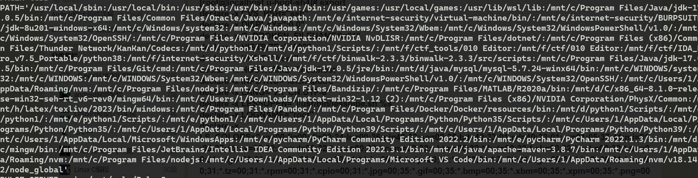

# 《操作系统综合实验》 实验报告

| 实验名称   | 实验日期  | 实验序号 | 实验人 |
| ---------- | --------- | -------- | ------ |
| UNIX Shell | 2024.3.30 | 2        | 周仙辉 |

## 一、  实验题目

​	A shell interface gives the user a prompt, after which the next command is entered. The example below illustrates the prompt osh> and the user’s next command: cat prog.c. (This command displays the file prog.c on the terminal using the UNIX cat command.) 

```osh>cat prog.c```

​	One technique for implementing a shell interface is to have the parent process first read what the user enters on the command line (in this case, cat prog.c) and then create a separate child process that performs the command. Unless otherwise specified, the parent process waits for the child to exit before continuing. This is similar in functionality to the new process creation illustrated in Figure 3.9. However, UNIX shells typically also allow the child process to run in the background, or concurrently. To accomplish this, we add an ampersand (&) at the end of the command. Thus, if we rewrite the above command as osh>cat prog.c & the parent and child processes will run concurrently. The separate child process is created using the fork() system call, and the user’s command is executed using one of the system calls in the exec() family (as described in Section 3.3.1). A C program that provides the general operations of a command-line shell is supplied in Figure 3.36. The main() function presents the prompt osh-> and outlines the steps to be taken after input from the user has been read. The main() function continually loops as long as should run equals 1; when the user enters exit at the prompt, your program will set should run to 0 and terminate.

​	This project is organized into several parts: 

1. **Creating the child process and executing the command in the child**
2. **Providing a history feature** 
3. **Adding support of input and output redirection**
4. **Allowing the parent and child processes to communicate via a pipe**

各部分细节自己看书，不在列出。

```c
#include <stdio.h>
#include <unistd.h>
#define MAX LINE 80 /* The maximum length command */
int main(void)
{
char *args[MAX LINE/2 + 1]; /* command line arguments */
int should run = 1; /* flag to determine when to exit program */
while (should run) {
printf("osh>");
fflush(stdout);
/**
* After reading user input, the steps are:
* (1) fork a child process using fork()
* (2) the child process will invoke execvp()
* (3) parent will invoke wait() unless command included &
*/
}
return 0;
}
```

## 二、  相关原理与知识

​	进程的相关概念，字符串的处理成参数，环境变量，管道，输入输出重定向。

## 三、  实验过程

### 构建框架

​	先将读入的字符串进行处理，形成char*args[]参数。然后区分内部命令 **built-in cmd**和外部命令，内部命令包括exit和history。外部命令创建子进程来执行。总体参考zsh来写。

### 字符串处理

​	通过空格，以及引号，分隔字符串。将指针写入args中。并注意 **&**。

### 外部命令和内部命令

内部命令直接通过父进程执行，外部命令fork子进程，通过execute执行。

内部命令和外部命令要区分前后台，就是用不用wait的区别。

#### history

history会显示除history外的历史命令，所以把指令加入数组要在指令执行之后 执行。

由于每次最多存10条，所以使用循环队列存储，并记录指令的序号。

#### ！！

执行上一条指令

#### ！ num

执行指定序号的指令

#### exit

直接退出就好了，同时增加ctrl-d退出的功能。

#### 外部命令

这个直接fork，然后execve就好了。

### 支持输出和输入的重定向

对参数进行检测，是否存在 "<" 或 ">",然后利用

dup2(fd, STDOUT_FILENO);

将输出结果由屏幕改到fd所代表文件。

或

dup2(fd,STDOUT_FILENO);

将文件内容作为输入内容。

### 管道

不用考虑 和重定向一起用。

> Finally, although several commands can be chained together using multiple pipes, you can assume that commands will contain only one pipe character and will not be combined with any redirection operators

这也不是很难，课上讲过类似的。

需要将之前的代码修改一下，当遇到'|'时需要多fork一次。然后将子进程和孙子进程通过管道交互。

## 四、  实验结果与分析

###  Executing Command in a Child Process &  Creating a History Feature

#### 执行命令

**/bin/ls**和 **./test**，其中test是当前目录下的一个可执行文件，能够输出hello world。


#### history

通过使用其他shell的经历来看：

- 在shell中重复使用一条指令时，只会加入一条到history中。
- 不会在history 中出现"!!" 或 "! num"
- history 展示时，第一条不会是history


### **Adding support of input and output redirection**

一直输路径很麻烦，后来就改成用execvp了。

**输出重定向**


**输入重定向**

因为ls 就是字母排序，先对out.txt 进行修改


然后排序


### **Allowing the parent and child processes to communicate via a pipe**

执行命令

```shell
ls | less
```


按q


再执行

```shell
ls -l | grep --color=auto 'a'
```


## 五、  问题总结

- **"!!" 和 "! idx"**

使用这两个命令时，注意不要将"!!"和"! idx"加入history中，会导致死循环。

- **wait 和 waitpid**

```
wait() and waitpid()
       The wait() system call suspends execution of the calling thread
       until one of its children terminates.  The call wait(&wstatus) is
       equivalent to:

           waitpid(-1, &wstatus, 0);

       The waitpid() system call suspends execution of the calling
       thread until a child specified by pid argument has changed state.
       By default, waitpid() waits only for terminated children, but
       this behavior is modifiable via the options argument, as
       described below.
```

由于会有后台进程运行，就导致该子进程没有被父进程回收。如果调用过多后台程序，会导致僵尸进程占用资源，所以需要使用循环来释放资源。

```c
 while (pid = waitpid(-1, NULL, 0)) {
			if(errno == ECHILD){
				break;
			}
	}
```

- **execlp  execve**

**int execve (** [*Path*](https://www.ibm.com/docs/en/aix/7.2?topic=e-exec-execl-execle-execlp-execv-execve-execvp-exect-fexecve-subroutine#exec__row-d3e62353)**,**  [*ArgumentV*](https://www.ibm.com/docs/en/aix/7.2?topic=e-exec-execl-execle-execlp-execv-execve-execvp-exect-fexecve-subroutine#exec__row-d3e62414)**,**     [*EnvironmentPointer*](https://www.ibm.com/docs/en/aix/7.2?topic=e-exec-execl-execle-execlp-execv-execve-execvp-exect-fexecve-subroutine#exec__row-d3e62429)**)**

**int execvp (** [*File*](https://www.ibm.com/docs/en/aix/7.2?topic=e-exec-execl-execle-execlp-execv-execve-execvp-exect-fexecve-subroutine#exec__row-d3e62359)**,**  [*ArgumentV*](https://www.ibm.com/docs/en/aix/7.2?topic=e-exec-execl-execle-execlp-execv-execve-execvp-exect-fexecve-subroutine#exec__row-d3e62414)**)**

一个使用pathname，另一个使用filename。前者完整路径（绝对和相对都可以）。

后者：

>Specifies a pointer to the name of the new-process image file. Unless the *File* parameter is a full path name, the path prefix for the file is obtained by searching the directories named in the **PATH** environment variable. The initial environment is supplied by the shell.

**PATH**环境变量，就是一些可执行文件的目录。

如：

在bin目录下就有常用的ls，date这些。

对比使用这两个函数的shell：

首先是**execvp**


其次是**execve**


### dup2 和 直接赋值的区别

直接赋值，共用一个文件描述符

dup2 ，创建一个新的文件描述符，也指向这个文件。关闭其中一个，文件并不会被关闭。

> ```
> 		After a successful return, the old and new file descriptors may
>  be used interchangeably.  Since the two file descriptors refer to
>  the same open file description, they share file offset and file
>  status flags; for example, if the file offset is modified by
>  using lseek(2) on one of the file descriptors, the offset is also
>  changed for the other file descriptor.
> ```

### 僵尸进程


出现了一个ls 的僵尸进程。发现是孙子进程忘记通过子进程回收。修改代码后正常。

## 六、  源代码

```c
#include<stdio.h>
#include<unistd.h>
#include<string.h>
#include<stdlib.h>
#include <sys/types.h>
#include <unistd.h>
#include <sys/wait.h>
#include <stdlib.h>
#include <sys/stat.h>
#include <fcntl.h>
#include <errno.h>
#include <sys/stat.h>
#include<wait.h>
#include <sys/wait.h>


#define READ_END 0
#define WRITE_END 1
#define lenth_h 12
#define MAX_LINE 80

char history[lenth_h][MAX_LINE] = {0};
int his_id;

int split_cmd(char cmd[],char* args[]);
void eval(char cmd[],char* args[]);
int builtin_cmd(char* args[],char []);
extern char** environ; /* 鐜鍙橀噺 */

int main(void){
	
	char *args[MAX_LINE/2 + 1];
	int should_run = 1;
	char cmd[MAX_LINE];

	while(should_run){
		printf("osh>");
		fflush(stdout);
		/*reading user input*/
		if(fgets(cmd,MAX_LINE,stdin) == NULL && ferror(stdin)){
			puts("fgets error");
		}

		/*
		if(feof(stdin)){ // ctrl-d 
			fflush(stdout);
			exit(0);
		}	
		*/
		/* eval the cmd line*/
		eval(cmd,args);
		fflush(stdout);
	//	fflush(stdout);
	}
	return 0;
}
int same_file(int fd1, int fd2) {
    struct stat stat1, stat2;
    if(fstat(fd1, &stat1) < 0) return -1;
    if(fstat(fd2, &stat2) < 0) return -1;
    return (stat1.st_dev == stat2.st_dev) && (stat1.st_ino == stat2.st_ino);
}
void execution(char * args[],char* cmd){
/* check the cmd is built-in or not */
	if(!builtin_cmd(args,cmd))
	{
			if(execvp(args[0],args) == -1){
				perror("execve");
				exit(0);
			}
			puts("never get here");
	}
}


/* return 0 if not call execvp */
void exe_intru(char* args[],char cmd[],int mark){


	pid_t pid = 0;
	pid = fork();
	if(pid < 0){
		perror("fork");
		exit(1);
	}

	if(!strcmp(args[0],"exit")){
		exit(0);
	}

	if(pid == 0){
		int fd[2];
		if(mark){
			char ** args1;
			char * cmd1;

			args1 = args+mark+1;
			for(int i=0; cmd[i]; i++)
			{
				if(cmd[i] == '|'){
					cmd1 = cmd+i+1;
					cmd[i] = '\0';
					break;
				}
			}


			if(pipe(fd) == -1){
				perror("pipe");
				exit(1);
			}
			
			pid = fork();
			//puts("mark");

			if(pid < 0){
				perror("fork");
				exit(1);
			}

			if(pid > 0){
				//printf("%s\n",cmd1);
				close(fd[WRITE_END]);
				dup2(fd[READ_END],STDIN_FILENO);
				execution(args1,cmd1);
				wait(NULL);
				exit(0);
				puts("never get here");
			}else{
				//printf("%s\n",cmd);
				close(fd[READ_END]);
				dup2(fd[WRITE_END],STDOUT_FILENO);
				execution(args,cmd);
				exit(0);
				puts("never get here");
			}
		}
		execution(args,cmd);
		exit(0);
	}
}

void eval(char cmd[],char* args[]){
	//puts("eval");
	
	int bg = split_cmd(cmd,args);

	/* check args is wheather NULL or not */
	if(args[0] == NULL){
		return;
	}

	int fd = -1;
	int old_std;
	/* check if "<" | ">" is in args */
	for(int i=1; args[i] ; i++){
		if(!strcmp(args[i],">")){
			fd = open(args[i+1],O_WRONLY|O_RDONLY|O_CREAT|O_TRUNC,0666);
			if(fd < 0){
				perror("open:");
			}
			old_std = dup(STDOUT_FILENO);
			dup2(fd,STDOUT_FILENO)	;
			args[i] = NULL;
			break;
		}else if(!strcmp(args[i],"<")){
			fd = open(args[i+1],O_RDONLY);
			if(fd < 0){
				perror("open:");
			}
			old_std = dup(STDIN_FILENO);
			dup2(fd,STDIN_FILENO);
			args[i] = NULL;
			break;
		}
	}
	/* check if '|' in args */
	int mark = 0;
	char ** args1;
	char *cmd1;
	for(int i=0; args[i];i++ ){
		if(!strcmp(args[i],"|"))
		{
			args1 = args+i+1;
			args[i] = NULL;
			mark = i;
		}
	}
	/*
	int i;
	for(i = 0; cmd[i]; i++){
		if(cmd[i] == '|'){
			cmd1 = cmd + i + 1;
			mark = 1;
			break;
		}
	}
	*/

	/* execution */
	pid_t pid;
	exe_intru(args,cmd,mark);

	/* forehead process should be waited */
	if(!bg){
		while ((pid = waitpid(-1, NULL, 0)) != -1) ;
	//	puts("forehead");
	}else{
		printf("[%d] %s",pid,cmd);
	}
	
		
		/* add cmd to the history */
	int num;
	if(strcmp(args[0],"!!") && strcmp(args[0],"!") && strcmp(history[his_id],cmd))
			strcpy(history[(++his_id)%10],cmd);
	else if(!strcmp(args[0],"!") && (num = atoi(args[1]) < his_id) && strcmp(history[his_id],history[num%10])) 
			strcpy(history[(++his_id)%10],history[num%10]);

	/* close file */
	if(fd >= 0){
		if( same_file(fd,1) )
		{
			dup2(old_std,STDOUT_FILENO);
		}else if( same_file(fd,0) ){
			dup2(old_std,STDIN_FILENO);
		}
		close(old_std);
		close(fd);
	}
	
}

void hist(char cmd[]){
	printf("history");
	for(int i=0; i<10; i++ ){
		if(history[(his_id-i)%10][0]){
			if(i == 0 && !strcmp(history[his_id%10],cmd)) continue;
			printf("\t %d %s",his_id-i,history[(his_id-i)%10]);
		}else{
			if(i == 0){
				puts("");
			}
			break;
		}
	}

}

int builtin_cmd(char* args[],char cmd[]){
	int builtin = 0;
	//printf("%s",args[0]);
	if( !strcmp(args[0],"history") ){
		//puts("history");
		hist(cmd);
		builtin = 1;
	}else if(!strcmp(args[0],"!!")){
		if(!history[(his_id)%10][0]){
			puts("No commands in history");
		}else {
			eval(history[(his_id)%10],args);
		}
		builtin = 1;
	}else if(!strcmp(args[0],"!")){
		int num = 0;
		//printf("args: %s\n",args[1]);
		if(args[1] && (num = atoi(args[1])) && (num > his_id - 10  && num <= his_id)){
			eval(history[num % 10],args);
		}else{
			printf("No such command in history,the num: %d",num);
		}
		builtin = 1;
	}else if(!strcmp(args[0],"exit")){
		exit(0);
		builtin = 1;/* never get here */
	}else{
		return builtin;
	}	

	return builtin;
}

int split_cmd(char cmd[],char* args[]){

	static char array[MAX_LINE]; // holds local copy of cmd 
	char* buf = array;
	strcpy(array,cmd);
	char* delim;
	int argc;
	int bg;

	//puts("split_cmd");

	argc = 0;
	buf[strlen(buf) -1] = ' ';// replace the '\n' with '
	//printf("buf: %s\n",buf)	;					  
	while(*buf && (*buf) == ' '){ /* ignore space */
		buf ++;	
	}	

	/* args maybe quotes with '' */
	if(*buf == '\''){
		buf++;
		delim = strchr(buf,'\'');
	}else{
		delim = strchr(buf,' ');
	}

	while(delim){
		args[argc++] = buf;
		*delim = '\0'; /* 杩欎釜寰堝叧閿紝杩欐牱鎵嶈兘鎶婂瓧绗︿覆鍓茶 */
		buf = delim + 1;
		while(*buf && (*buf) == ' '){
			buf++;
		}
		if(*buf == '\''){
			buf ++;
			delim = strchr(buf,'\'');
		}else{
			delim = strchr(buf,' ');
		}
	}

	args[argc] = NULL;

	if(argc == 0){
		return 1; /* ignore the blank line */
	}

	/*
	for(int i=0; args[i]; i++){
		printf("%s\n",args[i]);
	}
	*/
	
	if((bg = (*args[argc-1] == '&'))){
		args[--argc] = NULL;
	}
	
	return bg;
}
```


## 七、参考资料

- [wait(2) - Linux manual page (man7.org)](https://man7.org/linux/man-pages/man2/waitid.2.html)
- [exec 家族库函数以及系统调用（execl,execle,execlp and execv,execvp,execve） - lhyvip - 博客园 (cnblogs.com)](https://www.cnblogs.com/lhyzdd/p/13836927.html)
- [exec, execl, execle, execlp, execv, execve, execvp, exect, or fexecve Subroutine - IBM Documentation](https://www.ibm.com/docs/en/aix/7.2?topic=e-exec-execl-execle-execlp-execv-execve-execvp-exect-fexecve-subroutine)
- [PATH (变量) - 维基百科，自由的百科全书 (wikipedia.org)](https://zh.wikipedia.org/zh-cn/PATH_(变量))
- [c - Can I check if two FILE* or file descriptor numbers refer to the same file? - Stack Overflow](https://stackoverflow.com/questions/12502552/can-i-check-if-two-file-or-file-descriptor-numbers-refer-to-the-same-file)

- [c - Waiting for all child processes before parent resumes execution UNIX - Stack Overflow](https://stackoverflow.com/questions/1510922/waiting-for-all-child-processes-before-parent-resumes-execution-unix)