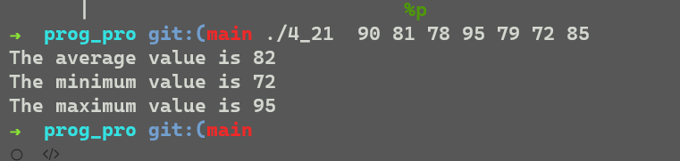

## hw4

### 网上学习linux 信号机制

[LINUX Signals (niu.edu)](https://faculty.cs.niu.edu/~hutchins/csci480/signals.htm)

学习了信号产生时会发生什么，进程如何发送信号，以及信号阻塞。

### practice exercise

#### 4_2

**differences**:

The existence of user-level threads is unknown to the kernel.User-level threads are managed without kernel support.user-level threads are faster to create than are kernel-level threads.User-level threads are scheduled by the thread library.

The OS kernel is aware of kernel-level threads. Kernel threads are scheduled by the OS’s scheduling algorithm, and each thread can be granted its own time slice. Kernel-level threads can be ran in parallel on the different CPUs.

**which one better**

User-level threads are much faster to switch between, as there is no context switch; further, a problem-domain-dependent algorithm can be used to schedule among them. CPU-bound tasks with interdependent computations, or a task that will switch among threads often, might best be handled by user-level threads.

Kernel-level threads are scheduled by the OS, and each thread can be granted its own timeslices by the scheduling algorithm. The kernel scheduler can thus make intelligent decisions among threads, and avoid scheduling processes which consist of entirely idle threads (or I/O bound threads). A task that has multiple threads that are I/O bound, or that has many threads (and thus will benefit from the additional timeslices that kernel threads will receive) might best be handled by kernel threads.

#### 4_4

**What resources are used when a thread is created?**

Code section
Data section
Other operation system resources such as open files and signals with other threads belonging to the same process whereas each and every process has separate code section, data section and operating system resources.
**How do they differ from those used when a process is created?**

Creating either a user or kernel thread involves allocating a small data structure (TCB, thread control block) to hold a register set, stack, state and priority. Because a thread is smaller than a process, thread creation typically uses fewer resources than process creation, and is more efficient.
Creating a process requires allocating a process control block (PCB), a rather large data structure. The PCB includes a memory map, list of open files, and environment variables. Allocating and managing the memory map is typically the most time-consuming activity.

### exercises

#### 4_7

When a kernel thread suffers a page fault, another kernel thread can be switched in to use the interleaving time in a useful manner.

A single-threaded process, on the other hand, will not be capable of performing useful work when a page fault takes place. Therefore, in scenarios where a program might suffer from frequent page faults or has to wait for other system events, a multithreaded solution would perform better even on a single-processor system.

#### 4_8

heap memory,global variables

#### 4_9

No.A multithreaded system comprising of multiple user-level threads cannot make use of the different processors in a multiprocessor system simultaneously. The operating system sees only a single process and will not schedule the different threads of the process on separate processors. Consequently, there is no performance benefit associated with executing multiple user-level threads on a multiprocessor system.

#### 4_14

**How many threads will you create to perform the input and output? Explain.**

1,1.

It only makes sense to create as many threads as there are blocking system calls, as the threads will be spent blocking. Creating additional threads provides no benefit. Thus, it makes sense to create a single thread for input and a single thread for output.
**How many threads will you create for the CPU-intensive portion of the application? Explain.**

4

 There should be as many threads as there are processing cores. Fewer would be a waste of processing resources, and any number > 4 would be unable to run.

#### 4_15

**How many unique processes are created?**

 If the parent process is also considered, 6 unique processes will be created.

##### How many unique threads are created?

2

#### 4_16

In systems where processes and threads are considered as similar entities, some of the operating system code could be simplified. A scheduler, for instance, can consider the different processes and threads on an equal footing without requiring special code to examine the threads associated with a process during every scheduling step. However, this uniformity could make it harder to impose process-wide resource constraints in a direct manner. Instead, some extra complexity is required to identify which threads correspond to which process and perform the relevant accounting tasks.

#### 4_17

c:5

p:0

#### 4_21

根据题意，写了三个函数，分别求平均值，最大值，最小值。

```c
#include<stdio.h>
#include<sys/types.h>
#include<wait.h>
#include<time.h>
#include<pthread.h>
#include<stdlib.h>

void * avg(void* argv[]){
	int sum = 0;
	int i = 0;
	while(argv[i] != NULL){
		sum += atoi(argv[i]);
		//printf("sum = %d\n",sum);
		i++;
	}	
	return (void*) (sum/i);
}

void * min(void* argv[]){
	int mi = 1e5 ;
	int i=0;
	while(argv[i] != NULL){
		int x = atoi(argv[i]);
		if(mi > x){
			mi = x;
		}
		i++;
	}
	return (void*) mi;
}

void * max(void* argv[]){
	int ma = -1e5;
	int i=0;
	while(argv[i] != NULL){
		int x = atoi(argv[i]);
		if(ma < x){
			ma = x;
		}
		i++;
	}
	return (void*) ma;
}

int main(int argc,char* argv[]){
	void* ouput;
	pthread_t tid[3];
	void* func[3]={&avg,&min,&max};
	char* format[3]={"The average value is ","The minimum value is ", "The maximum value is "};
	pthread_attr_t attr; /* set of thread attributes */
	
	pthread_attr_init(&attr);

    /* create three threads */
	for(int i=0; i<3; i++)
		pthread_create(&tid[i],&attr,func[i],&argv[1]);


	for(int i=0; i<3; i++)
	{
		pthread_join(tid[i],&ouput);
		printf("%s%d\n",format[i],ouput);
	}
	//printf("aaaaaaa\n");

}
```

结果：

