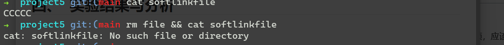

# 《操作系统综合实验》 实验报告

| 实验名称 | 实验日期 | 实验序号 | 实验人 |
| -------- | -------- | -------- | ------ |
| 文件系统 | 2024.6.8 | 5        | 周仙辉 |

##  一、  实验题目

The following exercise examines the relationship between files and inodes on a UNIX or Linux system. On these systems, files are represented with inodes. That is, an inode is a file (and vice versa). You can complete this exercise on the Linux virtual machine that is provided with this text. You can also complete the exercise on any Linux, UNIX, or Mac OS X system, but it will require creating two simple text files named file1.txt and file3.txt whose contents are unique sentences.

## 二、  相关原理与知识

Linux 文件系统相关知识

## 三、  实验过程

创建文件

用ls -i查看file1.txt和file3.txt的索引节点号码

接下来学习一下硬链接和符号链接

- [符号链接](https://zh.wikipedia.org/wiki/符号链接)，也称软链接，这是指向另一个不同路径文件的一个符号路径。
- [硬链接](https://zh.wikipedia.org/wiki/硬链接)，这是一个存储了链接建立时它所指向文件的实际数据的文件副本。

创建文件 file

创建软链接和硬链接

查看inode号，发现硬链接的inode号与file相同，而软链接则不同。

删除原文件并用符号链接访问。一开始能访问，删除原文件后不能。

用硬链接访问，说明

## 四、  实验结果与分析

一个inode号代表一个文件。所以file1.txt 和file3.txt的inode号不同。

硬链接与源文件inode号相同，说明这俩属于同一个文件（inode number)。或者说文件名只是别名，当不存在别名时，文件才会被删除。

软链接就类似指针，是单独文件。

当原文件被删除时，软链接无效，即指向的文件名不复存在。

