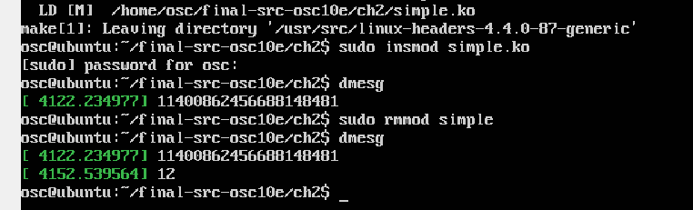
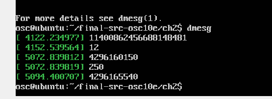
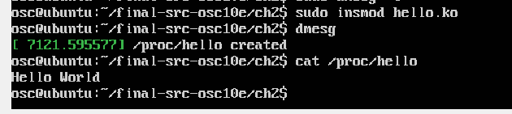
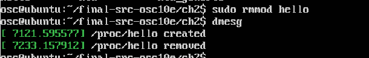
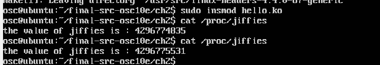
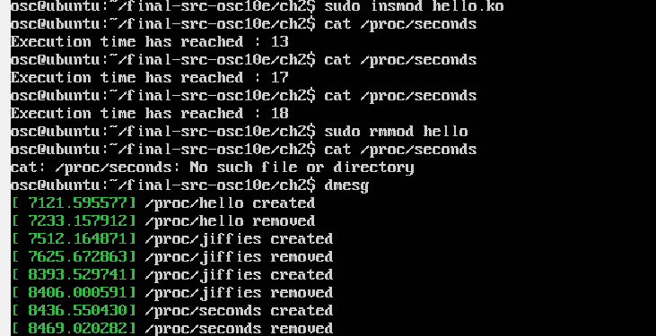

# program 1

从官网[Operating System Concepts - 10th edition (os-book.com)](https://www.os-book.com/OS10/index.html)下载相应的环境

## 1 加载和删除内核模块：simple

加载内核模块

```shell
sudo insmod simple.ko
```

删除内核模块

```shell
sudo rmmod simple
```

查看内核缓冲日志

```shell
dmesg
```

清空缓冲日志：

```shell
sudo dmesg -c
```

## 2 实现一些简单功能

### 1

1. Print out the value of GOLDEN RATIO PRIME in the simple init() function. 

2.  Print out the greatest common divisor of 3,300 and 24 in the simple exit() function.

   此处代码与下面类似，不重复了。

   **结果** ：

   

1.Print out the values of jiffies and HZ in the simple init() function. 

 2.Print out the value of jiffies in the simple exit() function.

```c
/**

 * simple.c
 *
 * A simple kernel module. 
 * 
 * To compile, run makefile by entering "make"
 *
 * Operating System Concepts - 10th Edition
 * Copyright John Wiley & Sons - 2018
 */

#include <linux/init.h>
#include <linux/module.h>
#include <linux/kernel.h>
#include <asm/param.h>
#include <linux/jiffies.h>

/* This function is called when the module is loaded. */
int simple_init(void)
{
	printk(KERN_INFO "%lu\n",jiffies);
	printk(KERN_INFO "%d\n",HZ);

       return 0;
}

/* This function is called when the module is removed. */
void simple_exit(void) {
	printk(KERN_INFO "%lu\n",jiffies);
}

/* Macros for registering module entry and exit points. */
module_init( simple_init );
module_exit( simple_exit );

MODULE_LICENSE("GPL");
MODULE_DESCRIPTION("Simple Module");
MODULE_AUTHOR("SGG");


```

**结果**：

上两条是上面打印的。



### 2

修改Makefile，编译。

打印helloworld：



移除：



#### 打印jiffies

代码：

修改下hello.c的代码，修改proc_name为jiffies，同时增加头文件jiffies，在原本输出helloworld的地方输出jiffies的值：

```c
/**
 * hello.c
 *
 * Kernel module that communicates with /proc file system.
 * 
 * The makefile must be modified to compile this program.
 * Change the line "simple.o" to "hello.o"
 *
 * Operating System Concepts - 10th Edition
 * Copyright John Wiley & Sons - 2018
 */

#include <linux/init.h>
#include <linux/module.h>
#include <linux/kernel.h>
#include <linux/proc_fs.h>
#include <asm/uaccess.h>
#include <linux/jiffies.h>

#define BUFFER_SIZE 128

#define PROC_NAME "jiffies"
#define MESSAGE "Hello World\n"

/**
 * Function prototypes
 */
ssize_t proc_read(struct file *file, char *buf, size_t count, loff_t *pos);

static struct file_operations proc_ops = {
        .owner = THIS_MODULE,
        .read = proc_read,
};


/* This function is called when the module is loaded. */
int proc_init(void)
{

        // creates the /proc/hello entry
        // the following function call is a wrapper for
        // proc_create_data() passing NULL as the last argument
        proc_create(PROC_NAME, 0, NULL, &proc_ops);

        printk(KERN_INFO "/proc/%s created\n", PROC_NAME);

	return 0;
}

/* This function is called when the module is removed. */
void proc_exit(void) {

        // removes the /proc/hello entry
        remove_proc_entry(PROC_NAME, NULL);

        printk( KERN_INFO "/proc/%s removed\n", PROC_NAME);
}

/**
 * This function is called each time the /proc/hello is read.
 * 
 * This function is called repeatedly until it returns 0, so
 * there must be logic that ensures it ultimately returns 0
 * once it has collected the data that is to go into the 
 * corresponding /proc file.
 *
 * params:
 *
 * file:
 * buf: buffer in user space
 * count:
 * pos:
 */
ssize_t proc_read(struct file *file, char __user *usr_buf, size_t count, loff_t *pos)
{
        int rv = 0;
        char buffer[BUFFER_SIZE];
        static int completed = 0;

        if (completed) {
                completed = 0;
                return 0;
        }

        completed = 1;

        rv = sprintf(buffer, "the value of jiffies is : %lu\n",jiffies);

        // copies the contents of buffer to userspace usr_buf
        copy_to_user(usr_buf, buffer, rv);

        return rv;
}


/* Macros for registering module entry and exit points. */
module_init( proc_init );
module_exit( proc_exit );

MODULE_LICENSE("GPL");
MODULE_DESCRIPTION("Hello Module");
MODULE_AUTHOR("SGG");


```

结果：




#### 打印已执行时间

代码：

类似，只是进行简单换算。

代码：

```c
/**
 * hello.c
 *
 * Kernel module that communicates with /proc file system.
 * 
 * The makefile must be modified to compile this program.
 * Change the line "simple.o" to "hello.o"
 *
 * Operating System Concepts - 10th Edition
 * Copyright John Wiley & Sons - 2018
 */

#include <linux/init.h>
#include <linux/module.h>
#include <linux/kernel.h>
#include <linux/proc_fs.h>
#include <asm/uaccess.h>
#include <asm/param.h>
#include <linux/jiffies.h>

#define BUFFER_SIZE 128

#define PROC_NAME "seconds"
#define MESSAGE "Hello World\n"

unsigned long origin;

/**
 * Function prototypes
 */
ssize_t proc_read(struct file *file, char *buf, size_t count, loff_t *pos);

static struct file_operations proc_ops = {
        .owner = THIS_MODULE,
        .read = proc_read,
};


/* This function is called when the module is loaded. */
int proc_init(void)
{

        // creates the /proc/hello entry
        // the following function call is a wrapper for
        // proc_create_data() passing NULL as the last argument
	origin = jiffies;
        proc_create(PROC_NAME, 0, NULL, &proc_ops);

        printk(KERN_INFO "/proc/%s created\n", PROC_NAME);

	return 0;
}

/* This function is called when the module is removed. */
void proc_exit(void) {

        // removes the /proc/hello entry
        remove_proc_entry(PROC_NAME, NULL);

        printk( KERN_INFO "/proc/%s removed\n", PROC_NAME);
}

/**
 * This function is called each time the /proc/hello is read.
 * 
 * This function is called repeatedly until it returns 0, so
 * there must be logic that ensures it ultimately returns 0
 * once it has collected the data that is to go into the 
 * corresponding /proc file.
 *
 * params:
 *
 * file:
 * buf: buffer in user space
 * count:
 * pos:
 */
ssize_t proc_read(struct file *file, char __user *usr_buf, size_t count, loff_t *pos)
{
        int rv = 0;
        char buffer[BUFFER_SIZE];
        static int completed = 0;

        if (completed) {
                completed = 0;
                return 0;
        }

        completed = 1;

        rv = sprintf(buffer, "Execution time has reached : %lu\n",(jiffies-origin)/HZ);

        // copies the contents of buffer to userspace usr_buf
        copy_to_user(usr_buf, buffer, rv);

        return rv;
}


/* Macros for registering module entry and exit points. */
module_init( proc_init );
module_exit( proc_exit );

MODULE_LICENSE("GPL");
MODULE_DESCRIPTION("Hello Module");
MODULE_AUTHOR("SGG");


```

**结果**

